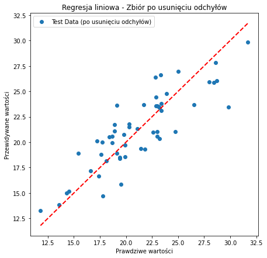

# Regresja Liniowa na Danych o Cenach Domów

## Opis projektu

Ten skrypt implementuje klasyczną regresję liniową w celu przewidywania cen domów na podstawie różnych cech, takich jak wskaźnik przestępczości, liczba pokoi, odległość do centrum, itp. Wykorzystuje on dane z pliku `housing.data`, a proces obejmuje eksploracyjną analizę danych (EDA), trenowanie modelu oraz ocenę jego skuteczności.

## Wymagania

Skrypt wymaga zainstalowanych następujących bibliotek:
- `numpy`
- `pandas`
- `matplotlib`
- `seaborn`
- `scikit-learn`

## Instrukcja uruchomienia

Aby zainstalować brakujące biblioteki, można użyć polecenia:
```bash
pip install numpy pandas matplotlib seaborn scikit-learn
```
Upewnij się, że plik housing.data znajduje się w tym samym folderze, co skrypt.
Uruchom skrypt za pomocą Pythona:
```bash
python script.py
```
## Struktura danych
Dane z pliku housing.data zawierają następujące kolumny:

| Kolumna    | Opis                                                   |
|------------|--------------------------------------------------------|
| CRIM       | Wskaźnik przestępczości na mieszkańca                  |
| ZN         | Procent terenów mieszkalnych przeznaczonych na działki |
| INDUS      | Procent powierzchni terenów przemysłowych              |
| CHAS       | Dummy variable (1 - w pobliżu rzeki, 0 - brak)         |
| NOX        | Stężenie tlenków azotu                                 |
| RM         | Średnia liczba pokoi na dom                            |
| AGE        | Procent domów zbudowanych przed 1940 r.                |
| DIS        | Odległość do centrów zatrudnienia w Bostonie           |
| RAD        | Wskaźnik dostępu do autostrad                         |
| TAX        | Stawka podatku na 10000 USD                            |
| PTRATIO    | Stosunek liczby uczniów do nauczycieli                 |
| B          | Wskaźnik liczby mieszkańców                            |
| LSTAT      | Procent populacji o niskim statusie ekonomicznym       |
| MEDV       | Medianowa cena domów (zmienna zależna)                 |

## Wprowadzenie danych
### 1. Wczytywanie danych

Dane dotyczące cen domów są wczytywane z pliku `housing.data`, który zawiera różne cechy, takie jak wskaźnik przestępczości, liczba pokoi, wiek budynków, itp. Wykorzystujemy funkcję `pd.read_csv()` z argumentem `delim_whitespace=True`, ponieważ dane w pliku są rozdzielone spacjami, a nie tradycyjnymi separatorami, takimi jak przecinki. Podajemy również nazwy kolumn (cech) ręcznie, ponieważ plik nie zawiera nagłówków.

**Cel:** Wczytanie danych z pliku, co umożliwia dalszą pracę z nimi w formacie tabelarycznym.

---

### 2. Sprawdzanie danych

W następnym kroku wyświetlamy typy danych dla każdej kolumny oraz pierwsze kilka wierszy danych. Dzięki temu możemy upewnić się, że dane zostały poprawnie wczytane i każda kolumna ma odpowiedni typ (np. liczbowy, jeśli powinna).

**Cel:** Sprawdzenie, czy dane są poprawne i zgodne z oczekiwaniami. Pozwala to wykryć ewentualne błędy, takie jak wartości tekstowe w kolumnach liczbowych.

---

### 3. Konwersja danych

Wszystkie kolumny są konwertowane na typ liczbowy. Jeśli w danych znajdziemy jakiekolwiek wartości błędne (np. tekst w kolumnach liczbowych), zostaną one zamienione na `NaN` (wartości brakujące).

**Cel:** Konwersja zapewnia, że dane są liczbowe, co jest niezbędne do dalszego modelowania. Wartości błędne są oznaczane jako brakujące, co pozwala na ich późniejsze usunięcie.

---

### 4. Sprawdzanie brakujących danych

Po konwersji danych sprawdzamy, ile brakujących wartości znajduje się w każdej kolumnie. To ważny krok, który pozwala ocenić, czy po konwersji pojawiły się braki i jak dużo danych musimy ewentualnie usunąć lub uzupełnić.

**Cel:** Upewnienie się, że dane są kompletne i gotowe do dalszej analizy. Pozwala to ocenić, które kolumny zawierają braki i jakie działania należy podjąć.

---

### 5. Usuwanie brakujących danych

Wszystkie wiersze, które zawierają brakujące dane (`NaN`), zostają usunięte. Dzięki temu dane są kompletne, a model regresji może pracować na pełnym zestawie danych.

**Cel:** Brakujące dane mogą powodować problemy w modelowaniu, dlatego usuwamy wiersze z brakami, aby model mógł działać poprawnie.

---

### Podsumowanie

W powyższych krokach przygotowaliśmy dane do dalszej analizy i modelowania, poprzez:

1. **Wczytanie danych** – zamiana danych z pliku na format tabelaryczny (DataFrame).
2. **Sprawdzenie poprawności** – upewnienie się, że dane mają poprawne typy.
3. **Konwersję i czyszczenie danych** – zamiana błędnych wartości na brakujące oraz usuwanie braków.

Dzięki temu procesowi dane są gotowe do dalszej analizy oraz budowy modelu regresji liniowej, co pozwoli na przewidywanie cen domów na podstawie wybranych cech.

## Eksploracyjna analiza danych (EDA)
### Rozkład zmiennej zależnej (MEDV - cena domów)


#### Wykres histogramu wraz z krzywą gęstości rozkładu (KDE)

Wykres histogramu wraz z krzywą gęstości rozkładu (KDE) pokazuje, jak rozkładają się ceny domów w naszym zbiorze danych. Używamy tego typu wykresu, aby zrozumieć rozkład zmiennej zależnej, którą w tym przypadku jest cena domów (MEDV). Dzięki temu możemy:

- **Ocenić normalność rozkładu**: Sprawdzamy, czy ceny domów mają rozkład zbliżony do normalnego, czyli czy większość wartości skupia się wokół średniej, a im bardziej oddalamy się od niej, tym mniej obserwacji widzimy.
- **Zidentyfikować wartości odstające**: Na wykresie możemy zauważyć potencjalne wartości odstające (outliers), czyli domy o nietypowo wysokich lub niskich cenach, które mogą wpływać na wyniki modelowania.
- **Sprawdzić asymetrię rozkładu**: Sprawdzamy, czy rozkład jest symetryczny, czy może ma asymetrię lewo- lub prawostronną (czyli, czy więcej wartości jest skoncentrowanych bliżej dolnej, czy górnej granicy).

#### Jak czytać ten wykres:

- **Słupki** na wykresie pokazują liczebność domów w różnych przedziałach cenowych. Wyższe słupki oznaczają, że więcej domów ma ceny mieszczące się w danym przedziale.
- **Krzywa KDE** (niebieska linia) ilustruje gęstość rozkładu cen – gładką wersję histogramu, pokazującą, gdzie skupiają się ceny w sposób bardziej intuicyjny.
- Obserwując krzywą KDE, możemy określić, czy rozkład jest jednolity, czy może są obszary, gdzie ceny są bardziej lub mniej skoncentrowane.

#### Informacje, które otrzymujemy:

- **Główne skupienie wartości**: W przypadku tego wykresu większość domów ma ceny pomiędzy 15 a 30 jednostek (MEDV). Oznacza to, że te ceny są najczęściej spotykane.
- **Wartości maksymalne**: Widać wyraźny skok w cenach domów o wartości 50. Może to oznaczać, że jest to maksymalna wartość w zbiorze danych (np. ograniczenie w danych). Może to być wartość "zablokowana", np. ceny domów powyżej 50 jednostek mogły zostać zaklasyfikowane jako 50.
- **Obecność wartości odstających**: Wartości powyżej 35 są znacznie mniej liczne, co sugeruje, że mamy do czynienia z niewielką liczbą drogich domów, które mogą być wartościami odstającymi. Zidentyfikowanie takich wartości jest istotne, ponieważ mogą one wpływać na dokładność modelu, a my możemy podjąć decyzję o ich usunięciu lub transformacji.

#### Co możemy z tym zrobić:

- **Transformacje zmiennej**: Jeżeli rozkład jest silnie skośny, możemy rozważyć przekształcenie zmiennej za pomocą np. logarytmu, aby uzyskać bardziej symetryczny rozkład, co często poprawia wyniki modelowania.
- **Usunięcie lub obsługa wartości odstających**: Jeżeli zauważymy skrajne wartości odstające, możemy podjąć decyzję o ich usunięciu lub bardziej zaawansowanej obróbce (np. wycięciu ich lub zastosowaniu technik ograniczania ich wpływu).
- **Sprawdzenie normalności rozkładu**: Jeżeli rozkład jest daleki od normalnego, możemy zdecydować się na zastosowanie nieliniowych technik regresji, które lepiej radzą sobie z takimi danymi.

#### Podsumowanie:

Wykres ten dostarcza nam kluczowych informacji na temat struktury danych i pomaga w podjęciu decyzji, jak dalej postępować w procesie modelowania. Na przykład, jeśli zauważymy dużą liczbę wartości odstających, możemy rozważyć ich usunięcie, co potencjalnie poprawi jakość naszego modelu regresji.

### Korelacja zmiennych z ceną domów (MEDV)


#### Wykres macierzy korelacji

Macierz korelacji tworzymy po to, aby zrozumieć, jakie zależności występują pomiędzy zmiennymi w naszym zbiorze danych. W szczególności zależy nam na zidentyfikowaniu zmiennych, które mają silny związek z ceną domów (MEDV). Korelacja między zmiennymi jest kluczowa w modelowaniu, ponieważ wpływa na to, jak różne cechy mogą być użyteczne w przewidywaniu zmiennej zależnej.

Wykres ten jest bardzo przydatny przy analizie danych, ponieważ:

- Pozwala zidentyfikować cechy silnie skorelowane z ceną domów (MEDV), co pomaga wybrać najbardziej istotne zmienne do modelowania.
- Pokazuje zależności między zmiennymi niezależnymi, co pozwala ocenić, czy występuje multikolinearność (czyli kiedy dwie lub więcej cech są silnie skorelowane, co może negatywnie wpływać na model).

#### Jak czytać ten wykres?

- **Osie X i Y** przedstawiają nazwy zmiennych (cech) z naszego zbioru danych.
- **Kolory** na wykresie reprezentują siłę i kierunek korelacji pomiędzy zmiennymi:
   - **Czerwony kolor** oznacza silną dodatnią korelację (wartości bliskie +1). Gdy jedna zmienna rośnie, druga również rośnie.
   - **Niebieski kolor** oznacza silną ujemną korelację (wartości bliskie -1). Gdy jedna zmienna rośnie, druga maleje.
   - **Kolory jasne** (blisko zera) oznaczają, że między zmiennymi nie ma istotnej zależności (korelacja bliska 0).
- **Wartości liczbowe** wewnątrz komórek oznaczają wartość współczynnika korelacji (od -1 do +1), co dokładnie określa siłę tej zależności.

#### Informacje, które otrzymujemy:

- **Zmienne silnie dodatnio skorelowane z ceną domów (MEDV):**
   - **RM** (średnia liczba pokoi) ma silną dodatnią korelację (+0.70) z ceną domów. Oznacza to, że więcej pokoi w domu zwykle wiąże się z wyższą ceną.

- **Zmienne silnie ujemnie skorelowane z ceną domów:**
   - **LSTAT** (procent populacji o niskim statusie ekonomicznym) ma silną ujemną korelację (-0.74) z ceną domów. Oznacza to, że wyższy odsetek populacji o niskim statusie ekonomicznym obniża cenę domów.
   - **PTRATIO** (stosunek liczby uczniów do nauczycieli) ma również umiarkowanie ujemną korelację z ceną domów (-0.51), co sugeruje, że wyższy wskaźnik może wiązać się z niższą ceną domów.

#### Multikolinearność:

- Możemy także zauważyć zależności między zmiennymi niezależnymi, np. silna korelacja między **TAX** (stawka podatku) a **RAD** (dostęp do autostrad) (+0.91). Multikolinearność może sprawić, że niektóre zmienne są nadmiarowe w modelu, co oznacza, że nie wszystkie z nich muszą być użyte.

#### Co możemy z tym zrobić?

- **Wybór zmiennych do modelu:** Dzięki macierzy korelacji możemy wybrać zmienne, które mają najsilniejszy wpływ na zmienną zależną (MEDV), i skupić się na nich przy trenowaniu modelu.

- **Obsługa multikolinearności:** Jeśli zauważymy, że niektóre zmienne są silnie skorelowane ze sobą, możemy rozważyć ich usunięcie lub zastosowanie technik, które radzą sobie z multikolinearnością (np. regresja grzbietowa).

- **Transformacje zmiennych:** Jeśli zmienne mają nieliniową zależność, możemy zastosować przekształcenia (np. logarytmiczne) lub użyć bardziej zaawansowanych modeli, które lepiej radzą sobie z takimi relacjami.

#### Podsumowanie:

Wykres macierzy korelacji dostarcza kluczowych informacji na temat relacji pomiędzy zmiennymi w naszym zbiorze danych. Na jego podstawie możemy wybrać istotne cechy do modelowania, usunąć zmienne nadmiarowe oraz podjąć decyzję o ewentualnych transformacjach, co poprawi jakość modelu regresji.

### Boxplot dla istotnych cech.


#### Wykres boxplot dla istotnych cech

Boxplot (wykres pudełkowy) tworzymy, aby zidentyfikować rozkład wartości dla poszczególnych cech oraz znaleźć potencjalne wartości odstające (outliers). Boxplot jest doskonałym narzędziem do wizualizacji takich cech jak mediana, kwartyle oraz wartości odstające w danych. Dla każdej zmiennej (w tym przypadku dla cech **RM**, **PTRATIO**, **LSTAT**) możemy zobaczyć ich rozkład, a także porównać zmienne między sobą.

#### Jak czytać ten wykres?

- **Środkowa linia w pudełku** reprezentuje medianę (wartość środkową danych).
- **Dolna i górna krawędź pudełka** to odpowiednio pierwszy i trzeci kwartyl (Q1 i Q3), które obejmują środkowe 50% wartości danych.
- **Wąsy** (linie rozciągające się od pudełka) pokazują minimalne i maksymalne wartości w zakresie 1.5 * IQR (Interquartile Range).
- **Kropki powyżej i poniżej wąsów** reprezentują wartości odstające (outliers), które leżą poza 1.5 * IQR.

#### Informacje, które otrzymujemy:

- **RM (średnia liczba pokoi)**: Wartości tej zmiennej są stosunkowo skupione wokół mediany (5-6 pokoi), ale widzimy kilka wartości odstających poniżej dolnej granicy (mniej niż 5 pokoi). Te wartości mogą wpływać na predykcję modelu i mogą wymagać dalszej analizy.

- **PTRATIO (stosunek uczniów do nauczycieli)**: Zmienna ta ma bardziej jednolity rozkład, ale widzimy kilka wartości odstających poniżej dolnej granicy. Wartości odstające mogą wskazywać na nietypowe szkoły lub lokalizacje z niskim stosunkiem uczniów do nauczycieli.

- **LSTAT (procent populacji o niskim statusie ekonomicznym)**: Zmienna ta ma szerszy zakres wartości. Widzimy liczne wartości odstające, zwłaszcza w górnym zakresie, co sugeruje, że w niektórych lokalizacjach jest bardzo wysoki odsetek populacji o niskim statusie ekonomicznym. To może znacząco wpływać na ceny domów, ponieważ wysokie wartości tej cechy są negatywnie skorelowane z ceną domów.

#### Co możemy z tym zrobić?

- **Obsługa wartości odstających (outliers)**: Boxplot pokazuje nam, które wartości mogą być wartościami odstającymi. Wartości te mogą wpływać na modelowanie i powodować błędy w przewidywaniach. Możemy rozważyć ich usunięcie lub przekształcenie.

- **Standaryzacja i normalizacja danych**: Jeżeli różnice w rozkładzie zmiennych są znaczne, można zastosować metody przekształcania zmiennych, np. logarytmowanie lub standaryzację, aby wyrównać ich wpływ na model.

- **Analiza wpływu zmiennych**: Boxplot pomaga ocenić zmienne o dużym rozrzucie, które mogą bardziej wpływać na modelowanie. Na przykład zmienna **LSTAT** ma szeroki zakres wartości, co może sugerować, że będzie miała znaczący wpływ na przewidywania cen domów.

#### Podsumowanie:

Boxplot dostarcza nam informacji na temat rozkładu danych i obecności wartości odstających. Możemy zdecydować, które zmienne wymagają dalszej analizy, przekształcenia lub oczyszczenia z wartości odstających, aby poprawić dokładność modelu predykcyjnego.

### Scatterplot (punktowy wykres rozproszenia)


#### Wykres scatterplot (punktowy wykres rozproszenia)

Scatterplot (punktowy wykres rozproszenia) tworzymy, aby zobaczyć relacje między różnymi zmiennymi w naszym zbiorze danych. Każdy punkt na wykresie reprezentuje jedną obserwację w danych. Ten wykres w szczególności pokazuje, jak zmienne niezależne, takie jak **RM** (średnia liczba pokoi), **PTRATIO** (stosunek uczniów do nauczycieli), **LSTAT** (procent populacji o niskim statusie ekonomicznym), są powiązane z naszą zmienną zależną, czyli **MEDV** (ceną domów).

#### Jak czytać ten wykres?

- Każdy wykres punktowy w macierzy pokazuje zależność między dwiema zmiennymi.
- Na przekątnej wykresu (diagonal) znajdują się histogramy, które pokazują rozkład każdej zmiennej.
- Wykresy poza przekątną pokazują, jak jedna zmienna wpływa na drugą – czy istnieje relacja liniowa, nieliniowa lub brak zależności.

#### Informacje, które otrzymujemy:

- **RM vs. MEDV**: Wykres pokazuje wyraźną dodatnią zależność. Im więcej pokoi ma dom (RM), tym wyższa jest jego cena (MEDV). Punkty są uporządkowane w kształt liniowy, co sugeruje, że istnieje prosta zależność między tymi dwiema zmiennymi.

- **LSTAT vs. MEDV**: Tutaj widzimy wyraźną ujemną zależność. Im wyższy procent populacji o niskim statusie ekonomicznym (LSTAT), tym niższa jest cena domu (MEDV). Wartości są rozmieszczone w formie odwrotnej krzywej, co sugeruje, że wzrost LSTAT gwałtownie obniża wartość domu.

- **PTRATIO vs. MEDV**: W przypadku PTRATIO nie widzimy silnej, bezpośredniej zależności. Punkty są rozproszone, co sugeruje, że stosunek uczniów do nauczycieli ma mniejszy wpływ na cenę domów.

#### Co możemy z tym zrobić?

1. **Wykorzystanie zmiennych w modelu**: Widzimy, które zmienne mają wyraźne, silne zależności z ceną domów (MEDV). Na przykład, zmienna **RM** i **LSTAT** mają wyraźny wpływ na cenę domów i powinny być uwzględnione w modelu predykcyjnym. Z drugiej strony, **PTRATIO** ma słabszą zależność z ceną, więc jej znaczenie w modelu może być mniejsze.

2. **Identyfikacja wartości odstających**: Na wykresach widzimy pojedyncze punkty daleko od reszty danych (outliers). Te wartości odstające mogą zaburzać model i warto je dodatkowo przeanalizować, np. usunąć lub zastosować transformacje.

3. **Sprawdzanie nieliniowych zależności**: W przypadku niektórych zmiennych, np. **LSTAT**, możemy zauważyć nieliniową zależność. W takim przypadku możemy rozważyć użycie nieliniowych metod modelowania lub przekształcenie zmiennych (np. przez logarytmowanie), aby lepiej dopasować dane.

#### Podsumowanie:
Wykres scatterplot pozwala nam zidentyfikować, które zmienne są silnie skorelowane z ceną domów, a które mają mniejszy wpływ. Pomaga też w identyfikacji wartości odstających oraz zależności nieliniowych, co może prowadzić do decyzji o dalszej obróbce danych lub zastosowaniu odpowiednich modeli predykcyjnych.

### Standaryzacja zmiennych. 

#### Standaryzacja: Czym jest, na czym polega i dlaczego jest potrzebna?

**Standaryzacja** (zwana również **normalizacją z-score**) to proces przekształcania zmiennych, aby miały średnią wartość równą **0** i odchylenie standardowe równe **1**. Dzięki temu, dane różniące się skalą mogą być bez problemu porównywane i traktowane równorzędnie w modelach.

#### Na czym polega standaryzacja?

Standaryzacja polega na przekształceniu każdej wartości zmiennej według wzoru:

\[z = \frac{x - \mu}{\sigma} \]

Gdzie:
- **x** to wartość, którą standaryzujemy,
- **μ** to średnia wartość danej zmiennej (obliczona na podstawie całego zbioru danych),
- **σ** to odchylenie standardowe tej zmiennej.

W wyniku tego przekształcenia, **wszystkie zmienne** w zbiorze danych będą miały średnią równą 0 i odchylenie standardowe równe 1.

#### Dlaczego dokonujemy standaryzacji?

1. **Usunięcie różnic w skalach zmiennych**:
   - Zmienne w zbiorach danych często mają różne jednostki miary. Przykładowo, w danych o nieruchomościach możemy mieć liczbę pokoi (która zwykle ma małe wartości, np. 2-8), a jednocześnie mieć cechę dotyczącą powierzchni (w metrach kwadratowych, gdzie wartości mogą wynosić od kilkudziesięciu do kilku tysięcy). W takich przypadkach modele oparte na odległościach (np. regresja liniowa, drzewa decyzyjne) mogą błędnie przypisać większe wagi zmiennym o większych wartościach.
   - Standaryzacja "wyrównuje" te zmienne, tak aby żadna z nich nie dominowała nad innymi tylko ze względu na większą skalę.

2. **Lepsza konwergencja modeli**:
   - Niektóre algorytmy, takie jak **regresja liniowa**, **SVM** (Support Vector Machines), czy **KNN** (K-Nearest Neighbors) są wrażliwe na różnice w skalach zmiennych. Standaryzacja pomaga w szybszej i bardziej stabilnej konwergencji algorytmów, co skraca czas treningu i poprawia wyniki.

3. **Zapobieganie nadmiernemu przywiązywaniu wagi do jednej zmiennej**:
   - W modelach, które wyliczają wagi dla zmiennych, zmienne o większych wartościach (np. powierzchnia domu) mogą mieć nieproporcjonalnie duży wpływ na model w porównaniu do zmiennych z mniejszymi wartościami (np. liczba pokoi). Standaryzacja zapobiega takim sytuacjom, zapewniając, że model nie będzie faworyzować żadnej zmiennej tylko ze względu na jej skalę.

#### Kiedy powinniśmy stosować standaryzację?

Standaryzację warto stosować:
- **W modelach opartych na odległościach**: Modele takie jak KNN, SVM, regresja liniowa, czy metody gradientowe są bardzo wrażliwe na różnice w skalach zmiennych.
- **Przy porównywaniu zmiennych o różnych jednostkach**: Gdy zmienne w zbiorze danych mają różne jednostki miary, np. powierzchnia domu i liczba pokoi, standaryzacja jest kluczowa.
- **Przy uczeniu głębokim**: W sieciach neuronowych standaryzacja pomaga w szybszym i bardziej stabilnym procesie uczenia.

#### Podsumowanie

### Standaryzacja zmiennych
**Standaryzacja** jest istotnym krokiem w przetwarzaniu danych, który pomaga zapewnić, że model będzie sprawiedliwie traktował wszystkie zmienne, niezależnie od ich oryginalnych jednostek i zakresów wartości. Poprawia to stabilność i dokładność wielu modeli, szczególnie tych opartych na odległościach i gradientach.


Tworzymy wykresy **boxplot** przed i po **standaryzacji zmiennych**, aby zobaczyć, jak rozkład wartości w wybranych istotnych cechach zmienia się po transformacji danych. Boxplot pomaga zobaczyć medianę, rozkład wartości i ewentualne wartości odstające w danych. Standaryzacja natomiast jest kluczowa, gdy chcemy, aby wszystkie zmienne miały podobną skalę, co poprawia działanie algorytmów, które są wrażliwe na różnice w skalach zmiennych.

#### 1. Boxplot przed standaryzacją (górny wykres):
- Przed standaryzacją, różne cechy (np. **RM**, **PTRATIO**, **LSTAT**) mają bardzo różne skale wartości.
- Wartość cechy **RM** (średnia liczba pokoi) mieści się w zakresie od 3 do 8, podczas gdy dla **LSTAT** (procent populacji o niskim statusie ekonomicznym) jest to zakres od 1 do 35.
- Możemy także zobaczyć wartości odstające (outliers), czyli punkty znajdujące się znacznie poza głównym rozkładem danych, np. w **RM** i **LSTAT**.

#### 2. Boxplot po standaryzacji (dolny wykres):
- Po standaryzacji wszystkie cechy mają średnią bliską 0 i odchylenie standardowe wynoszące 1, co widać na wykresie.
- Dane dla każdej zmiennej mają teraz bardziej porównywalny rozkład, dzięki czemu model liniowy będzie działał bardziej efektywnie.
- Nadal widzimy wartości odstające, ale są one wyrażone w standaryzowanej skali.

#### Jak czytać ten wykres?

- Każdy boxplot pokazuje zakres danych (od dolnego do górnego kwartyla) z linią w środku (mediana). Linie wystające poza pudełko (wąsy) pokazują, jak bardzo dane są rozproszone, a kropki poza wąsami to wartości odstające.
- Przed standaryzacją możemy zauważyć duże różnice w wartościach pomiędzy różnymi zmiennymi, co może negatywnie wpływać na model, ponieważ cechy z większymi wartościami mogą dominować nad tymi o mniejszych wartościach.
- Po standaryzacji wszystkie zmienne są wyrażone na tej samej skali, co oznacza, że model będzie równo traktował wszystkie zmienne bez względu na ich pierwotną skalę.

#### Jakie informacje daje nam ten wykres?

- Standaryzacja zmienia skalę zmiennych, ale nie wpływa na wartości odstające. Nadal możemy zobaczyć punkty oznaczone jako odstające, co oznacza, że mogą one wpływać na model.
- Przed standaryzacją widać, że zmienne mają różną skalę, co mogłoby powodować problemy w niektórych algorytmach, zwłaszcza w regresji liniowej, gdzie wagi przypisywane zmiennym są zależne od ich wielkości.

#### Co możemy z tym zrobić?

1. **Analiza wartości odstających**: Po zobaczeniu, że mamy wartości odstające, możemy podjąć decyzję o ich usunięciu, ponieważ mogą negatywnie wpływać na model.
2. **Użycie standaryzacji**: Po standaryzacji zmienne są na tej samej skali, co poprawia działanie algorytmów wrażliwych na różnice w skalach zmiennych (np. regresja liniowa).
3. **Transformacje zmiennych**: Jeśli wartości odstające są zbyt liczne, możemy rozważyć transformację zmiennych (np. logarytmiczną), aby lepiej je dopasować do modelu.

#### Podsumowanie
Te wykresy pomagają nam zrozumieć rozkład zmiennych i wpływ standaryzacji na dane, co jest kluczowe dla uzyskania lepszych wyników modelowania.

### Usuwanie odchyłów (outliers) za pomocą IQR (Interquartile Range)

#### Usuwanie odchyłów (outliers) za pomocą IQR (Interquartile Range)

**Odchyły** (ang. outliers) to nietypowe obserwacje w zbiorze danych, które znacząco różnią się od innych wartości. Mogą one zaburzać wyniki modelu, szczególnie w algorytmach opartych na średnich czy odległościach (np. regresja liniowa, kNN). Dlatego ważne jest, aby rozważyć ich usunięcie lub przekształcenie przed trenowaniem modelu.

#### Czym jest IQR (Interquartile Range)?

**IQR** to tzw. **rozstęp międzykwartylowy**, który mierzy zakres wartości w środku rozkładu danych. Jest to różnica pomiędzy trzecim kwartylem (**Q3**, 75. percentyl) a pierwszym kwartylem (**Q1**, 25. percentyl):

\[
\text{IQR} = Q3 - Q1
\]

- **Q1 (pierwszy kwartyl)**: Wartość, poniżej której znajduje się 25% danych.
- **Q3 (trzeci kwartyl)**: Wartość, poniżej której znajduje się 75% danych.

Dzięki IQR możemy łatwo zidentyfikować, które obserwacje są odchyłami, czyli wartościami wykraczającymi poza "typowy" zakres danych.

#### Jak identyfikujemy odchyły za pomocą IQR?

Odchyły definiuje się jako wartości, które są **znacznie mniejsze lub większe** od reszty danych. Zwykle za odchyły uznaje się wartości, które leżą poza następującymi granicami:

- **Dolna granica**: \( Q1 - 1.5 \times \text{IQR} \)
- **Górna granica**: \( Q3 + 1.5 \times \text{IQR} \)

Wartości, które leżą poniżej dolnej granicy lub powyżej górnej granicy, są uznawane za odchyły.

#### Na czym polega usuwanie odchyłów za pomocą IQR?

1. **Obliczenie IQR**: Najpierw obliczamy kwartyle (Q1 i Q3) oraz wartość IQR dla każdej zmiennej.
2. **Wyznaczenie granic**: Następnie, na podstawie wartości IQR, obliczamy dolne i górne granice dla każdej zmiennej.
3. **Identyfikacja odchyłów**: Sprawdzamy, które wartości w danych leżą poniżej dolnej granicy lub powyżej górnej granicy.
4. **Usuwanie odchyłów**: Wartości leżące poza wyznaczonym zakresem (czyli odchyły) są usuwane ze zbioru danych.

#### Dlaczego usuwamy odchyły?

1. **Zaburzają model**: Odchyły mogą wprowadzać błędy w modelu, szczególnie w algorytmach, które są wrażliwe na wartości ekstremalne, takich jak regresja liniowa. Odchyły mogą nieproporcjonalnie wpływać na oszacowanie modelu, np. zawyżając lub zaniżając predykcje.
2. **Wpływają na interpretację**: Obecność odchyłów może prowadzić do błędnych wniosków, zwłaszcza w analizie opisowej i modelowaniu predykcyjnym.
3. **Poprawa jakości danych**: Usunięcie odchyłów pomaga w uzyskaniu bardziej reprezentatywnego modelu i eliminuje potencjalne źródła błędów.

#### Jakie są potencjalne kroki po usunięciu odchyłów?

1. **Modelowanie na oczyszczonych danych**: Po usunięciu odchyłów model może działać lepiej, ponieważ będzie trenowany na bardziej reprezentatywnych danych.
2. **Transformacja zmiennych**: Zamiast usuwać odchyły, możemy przekształcić zmienne (np. za pomocą logarytmu) w celu zmniejszenia ich wpływu na model.
3. **Zachowanie odchyłów**: W niektórych przypadkach odchyły mogą być istotne, np. w analizach finansowych (ekstremalne wartości mogą sygnalizować rzadkie, ale ważne zjawiska), więc zamiast usuwać je, warto je dokładniej przeanalizować.

#### Podsumowanie

**Usuwanie odchyłów za pomocą IQR** to jedna z popularnych metod czyszczenia danych, która pomaga w identyfikacji i usuwaniu wartości ekstremalnych, mogących zaburzać wyniki modeli predykcyjnych. Metoda ta pozwala uzyskać lepszą jakość danych, co przekłada się na bardziej trafne prognozy i interpretacje.

## Modelowanie
- Trenowanie modelu regresji liniowej.

Do trenowania modelu używany jest algorytm regresji liniowej z biblioteki scikit-learn. Dane są podzielone na zbiór treningowy (80%) i testowy (20%).

- Predykcja wartości cen domów na zbiorze testowym.

- Analiza skuteczności modelu za pomocą metryk takich jak MAE, MSE i R².

Model oceniany jest za pomocą następujących metryk:

### Metryki oceny modelu regresji

Podczas oceny modeli regresji, takich jak regresja liniowa, musimy mieć narzędzia, które pozwolą nam ocenić, jak dobrze nasz model przewiduje zmienną zależną na podstawie zmiennych niezależnych. Do tego służą trzy popularne metryki: **MAE**, **MSE** oraz **R²**. Każda z nich dostarcza nieco innej perspektywy na temat skuteczności modelu.

---

#### 1. **MAE (Mean Absolute Error)** - Średnia Bezwzględna Błąd

**Definicja**:
Mean Absolute Error (MAE) to średnia bezwzględna różnica między wartościami rzeczywistymi (prawdziwymi) a przewidywanymi przez model. MAE można zapisać jako:

\[
\text{MAE} = \frac{1}{n} \sum_{i=1}^{n} |y_i - \hat{y_i}|
\]

Gdzie:
- \( y_i \) to rzeczywista wartość,
- \( \hat{y_i} \) to przewidywana wartość,
- \( n \) to liczba próbek.

**Po co wyznaczamy MAE?**:
- MAE informuje nas, jaka jest **przeciętna różnica** (w jednostkach oryginalnych) między przewidywaniami a rzeczywistymi wartościami, niezależnie od tego, w którą stronę popełniono błąd (dodatni lub ujemny).
- Jest to intuicyjna i łatwa do zrozumienia miara, ponieważ wyrażona jest w tej samej jednostce co zmienna zależna.

**Jak interpretować MAE?**:
- **Niższe wartości MAE** oznaczają, że model ma mniejszą przeciętną różnicę między rzeczywistymi a przewidywanymi wartościami.
- Na przykład, jeżeli MAE wynosi 2, oznacza to, że na każdej prognozie przeciętnie popełniamy błąd wynoszący 2 jednostki (np. dolary, metry itp.).
- **Porównanie modeli**: Im niższa wartość MAE w porównaniu do innych modeli, tym lepszy model, jednak nie daje nam informacji o kierunku błędu.

---

#### 2. **MSE (Mean Squared Error)** - Średnia Kwadratowa Błąd

**Definicja**:
Mean Squared Error (MSE) to średnia różnica między rzeczywistymi a przewidywanymi wartościami, podniesiona do kwadratu. MSE można zapisać jako:

\[
\text{MSE} = \frac{1}{n} \sum_{i=1}^{n} (y_i - \hat{y_i})^2
\]

**Po co wyznaczamy MSE?**:
- MSE jest bardziej wrażliwy na większe błędy niż MAE, ponieważ różnice są podnoszone do kwadratu. Oznacza to, że większe błędy są "karane" w większym stopniu.
- Używamy MSE, gdy chcemy, aby nasz model minimalizował nie tylko średni błąd, ale także ograniczał przypadki dużych błędów.

**Jak interpretować MSE?**:
- **Niższe wartości MSE** są lepsze, ponieważ oznaczają, że model popełnia mniejsze błędy.
- **Wady**: MSE wyrażone jest w **kwadracie jednostek**, co może utrudniać interpretację. Na przykład, jeśli oryginalne dane były w dolarach, MSE będzie wyrażony w dolarach kwadratowych. To sprawia, że MSE może być mniej intuicyjny niż MAE.
- Jednak MSE dobrze pokazuje, jak model radzi sobie z dużymi błędami, dając nam dodatkową perspektywę.

---

#### 3. **R² (R-Squared)** - Współczynnik determinacji

**Definicja**:
Współczynnik determinacji \( R^2 \) mierzy, jaka część zmienności w danych zależnych (np. ceny domów) jest wyjaśniana przez model. \( R^2 \) można zapisać jako:

\[
R^2 = 1 - \frac{\sum_{i=1}^{n} (y_i - \hat{y_i})^2}{\sum_{i=1}^{n} (y_i - \bar{y})^2}
\]

Gdzie:
- \( \bar{y} \) to średnia wartość rzeczywistych danych.

**Po co wyznaczamy \( R^2 \)?**:
- \( R^2 \) informuje nas o tym, jak **dobrze model dopasowuje się do danych**. Mówiąc prościej, mówi nam, jaki procent zmienności w danych został wyjaśniony przez zmienne niezależne.
- \( R^2 \) jest stosowany jako **ogólny wskaźnik jakości modelu**.

**Jak interpretować \( R^2 \)?**:
- \( R^2 \) przyjmuje wartości od 0 do 1:
   - **Blisko 1**: Model dobrze dopasowuje się do danych i wyjaśnia większość zmienności.
   - **Blisko 0**: Model wyjaśnia bardzo mało zmienności, co oznacza, że jest słaby w przewidywaniu.
   - **Wartości ujemne** mogą wystąpić, gdy model jest gorszy od przewidywania średniej wartości.

- Na przykład \( R^2 = 0.75 \) oznacza, że model wyjaśnia 75% zmienności w danych, co sugeruje dobrą jakość dopasowania.
- Należy pamiętać, że **\( R^2 \) nie mówi nic o jakości indywidualnych prognoz**, tylko o tym, jak dobrze model radzi sobie z danymi jako całością.

---

### Podsumowanie:

- **MAE**: Mierzy średni błąd bezwzględny, który łatwo zinterpretować, ponieważ wyrażony jest w tej samej jednostce co zmienna zależna.
- **MSE**: Podkreśla duże błędy, dlatego używamy go, gdy chcemy ograniczyć przypadki dużych odchyleń.
- **R²**: Informuje nas, jak dobrze model wyjaśnia zmienność danych, ale nie mówi o jakości indywidualnych prognoz.

Podczas oceny modeli regresji warto korzystać z kilku metryk, aby mieć pełen obraz tego, jak model radzi sobie z przewidywaniami. Każda z tych miar dostarcza innych informacji, które wspólnie pozwalają ocenić, czy model jest wystarczająco skuteczny i jakie elementy można poprawić.


## Wizualizacja wyników

### 1. Wykres **Rzeczywiste wartości vs Przewidywane wartości**

- **Po co tworzymy ten wykres**:
  Wykres pokazuje, jak dobrze model regresji liniowej przewiduje rzeczywiste wartości. Im bardziej punkty leżą blisko czerwonej, przerywanej linii (idealna linia y = x), tym lepiej model przewiduje wartości.

- **Jak go czytać**:
   - Punkty przedstawiają rzeczywiste wartości (na osi x) w porównaniu do przewidywanych wartości (na osi y).
   - Punkty leżące blisko czerwonej linii wskazują na dobrą zgodność modelu z rzeczywistymi danymi.
   - Duże odchylenia od linii sugerują błędy w przewidywaniach modelu.

- **Informacje, które dostajemy**:
   - Możemy ocenić, jak dobrze model radzi sobie z przewidywaniem danych.
   - Widoczne odchylenia mogą sugerować, że model nie radzi sobie dobrze z pewnymi przedziałami danych (np. wyższe ceny domów).

- **Co możemy z tym zrobić**:
   - Jeśli widzimy systematyczne odchylenia (np. wszystkie wysokie wartości są źle przewidywane), możemy rozważyć przekształcenie zmiennych lub zastosowanie bardziej zaawansowanych modeli (np. regresji nieliniowej).

### 2. Wykres **Rzeczywiste vs Przewidywane po usunięciu odchyłów**

- **Po co tworzymy ten wykres**:
  Pokazuje, jak zmieniły się przewidywania modelu po usunięciu wartości odstających (outliers). Pozwala to ocenić, czy model stał się bardziej dokładny po tej operacji.

- **Jak go czytać**:
   - Analogicznie do pierwszego wykresu, punkty leżące blisko czerwonej linii wskazują na dobrą zgodność modelu z rzeczywistymi danymi.
   - Jeśli po usunięciu odchyłów wyniki są lepsze (punkty są bliżej linii), model działa bardziej precyzyjnie.

- **Informacje, które dostajemy**:
   - Możemy sprawdzić, jak usunięcie wartości odstających wpłynęło na jakość modelu.

- **Co możemy z tym zrobić**:
   - Jeśli po usunięciu outliers model działa lepiej, możemy zdecydować się na trzymanie tego podejścia przy kolejnych iteracjach modelowania. Możemy też porównać wyniki przed i po, aby ocenić skuteczność.

### 3. **Wykres residuów (różnice rzeczywiste - przewidywane)**

- **Po co tworzymy ten wykres**:
  Wykres residuów pokazuje, jak różnią się rzeczywiste wartości od przewidywanych w zależności od samych przewidywanych wartości. Pomaga zidentyfikować ewentualne wzorce błędów (np. systematyczne niedoszacowanie lub przeszacowanie modelu).

- **Jak go czytać**:
   - Idealnie, punkty powinny być losowo rozproszone wokół czerwonej linii na poziomie 0 (brak błędów).
   - Jeśli widzimy wzorzec (np. krzywą lub linię), może to sugerować problemy z założeniami modelu liniowego.

- **Informacje, które dostajemy**:
   - Pozwala ocenić, czy błędy są rozproszone losowo, czy mają pewien wzór, który model nie jest w stanie uchwycić.

- **Co możemy z tym zrobić**:
   - Jeśli błędy nie są rozproszone losowo (np. mamy wzorzec liniowy lub kwadratowy), może to sugerować, że model nie radzi sobie z pewnymi typami danych i może wymagać bardziej zaawansowanych technik, jak regresja wielomianowa lub nieliniowa.

### 4. Wykres **Rozkład residuów (błędy)**

- **Po co tworzymy ten wykres**:
  Wykres pokazuje, jak są rozłożone różnice (błędy) między rzeczywistymi a przewidywanymi wartościami. Służy do oceny, czy błędy mają rozkład normalny, co jest jednym z założeń regresji liniowej.

- **Jak go czytać**:
   - Histogram przedstawia, jak często pojawiają się różnice między przewidywanymi a rzeczywistymi wartościami.
   - Krzywa gęstości (KDE) pokazuje, jak gładko rozłożone są te błędy.
   - Idealnie, jeśli błędy mają rozkład normalny (są symetryczne wokół zera).

- **Informacje, które dostajemy**:
   - Możemy ocenić, czy błędy mają rozkład normalny, co potwierdza, że model spełnia założenia regresji liniowej.

- **Co możemy z tym zrobić**:
   - Jeśli rozkład błędów nie jest symetryczny (np. ma wyraźną skośność), możemy rozważyć transformacje zmiennych lub poprawienie modelu, np. poprzez usunięcie wartości odstających.