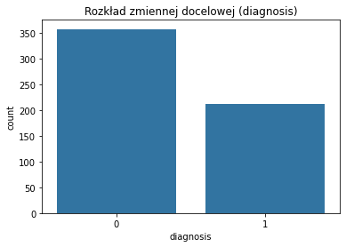
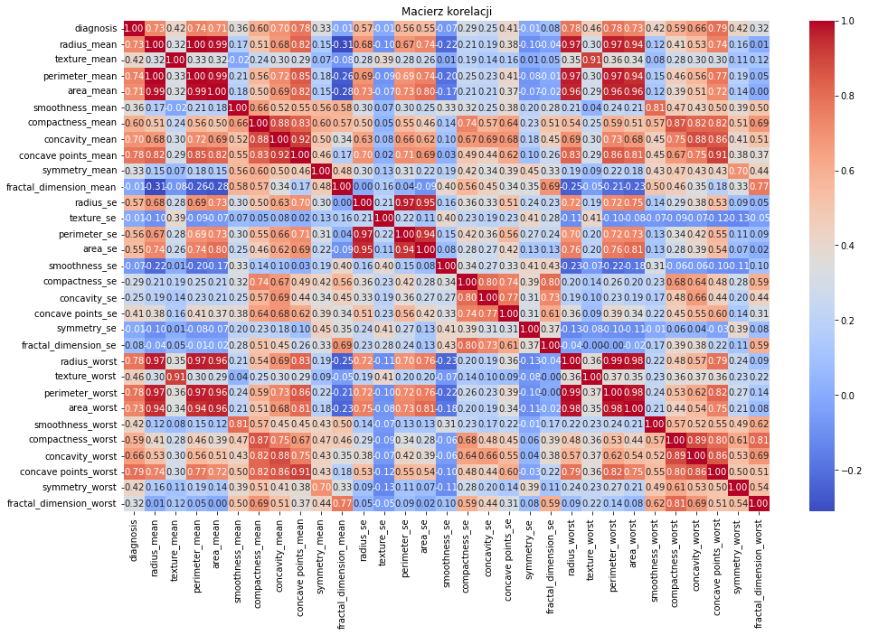
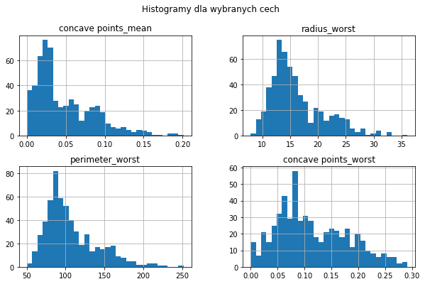
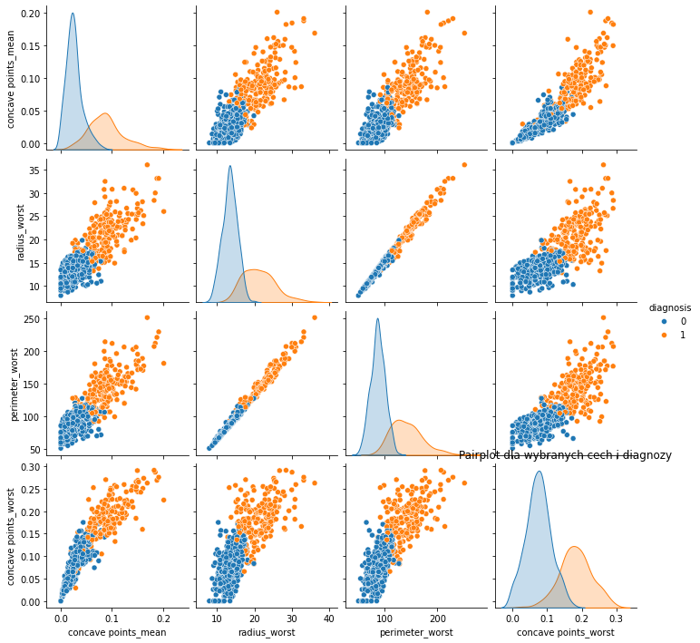
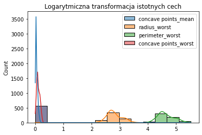
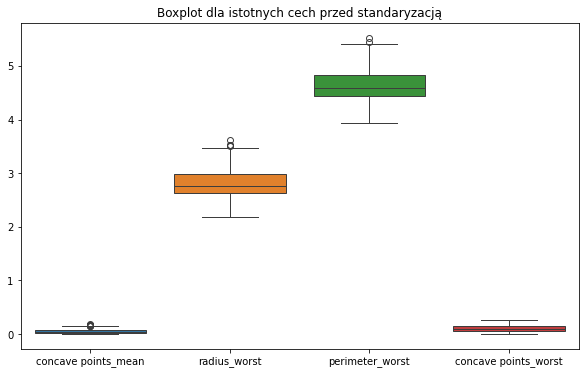
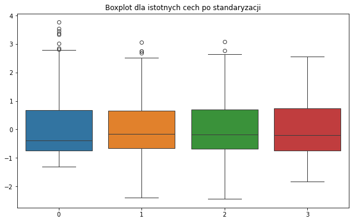
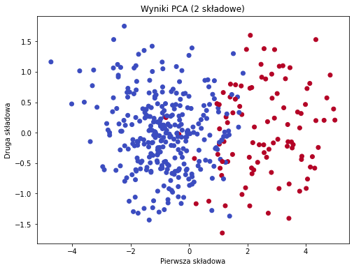
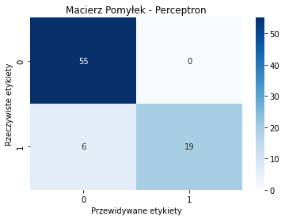

# Perceptron na Danych o Raku Piersi

## Opis projektu

Ten projekt implementuje algorytm Perceptronu w celu klasyfikacji nowotworów piersi na podstawie zbioru danych o cechach fizycznych komórek, takich jak promień, tekstura, obwód i inne. Dane zawierają informacje na temat nowotworów złośliwych (M) i łagodnych (B), a proces obejmuje eksploracyjną analizę danych (EDA), trenowanie modelu perceptronu oraz ocenę jego skuteczności.

## Wymagania

Skrypt wymaga zainstalowanych następujących bibliotek:
- `numpy`
- `pandas`
- `matplotlib`
- `seaborn`
- `scikit-learn`
- 
## Instrukcja uruchomienia

Aby zainstalować brakujące biblioteki, można użyć polecenia:
```bash
pip install numpy pandas matplotlib seaborn scikit-learn
```
Upewnij się, że plik housing.data znajduje się w tym samym folderze, co skrypt.
Uruchom skrypt za pomocą Pythona:
```bash
python script.py
```

## Struktura danych
Dane z pliku wdbc.data zawierają następujące kolumny:

| Kolumna                   | Opis                                                                                |
|---------------------------|-------------------------------------------------------------------------------------|
| `id`                       | Identyfikator próbki, unikalny numer przypisany do każdej próbki                    |
| `diagnosis`                | Diagnoza nowotworu: 'M' (złośliwy) lub 'B' (łagodny)                                |
| `radius_mean`              | Średni promień komórki                                                              |
| `texture_mean`             | Średnia tekstura powierzchni komórki                                                |
| `perimeter_mean`           | Średni obwód komórki                                                                |
| `area_mean`                | Średnia powierzchnia komórki                                                        |
| `smoothness_mean`          | Średnia gładkość komórki, definiowana jako zmienność długości promienia             |
| `compactness_mean`         | Średnia zwartość komórki, obliczana jako stosunek obwodu do powierzchni             |
| `concavity_mean`           | Średnia wklęsłość konturu komórki (jak bardzo kontur jest wklęsły)                  |
| `concave points_mean`      | Średnia liczba wklęsłych punktów w konturze komórki                                 |
| `symmetry_mean`            | Średnia symetria komórki                                                            |
| `fractal_dimension_mean`   | Średni wymiar fraktalny konturu komórki (złożoność kształtu)                        |
| `radius_se`                | Odchylenie standardowe promienia komórki                                            |
| `texture_se`               | Odchylenie standardowe tekstury powierzchni komórki                                 |
| `perimeter_se`             | Odchylenie standardowe obwodu komórki                                               |
| `area_se`                  | Odchylenie standardowe powierzchni komórki                                          |
| `smoothness_se`            | Odchylenie standardowe gładkości komórki                                            |
| `compactness_se`           | Odchylenie standardowe zwartości komórki                                            |
| `concavity_se`             | Odchylenie standardowe wklęsłości konturu komórki                                   |
| `concave points_se`        | Odchylenie standardowe liczby wklęsłych punktów w konturze komórki                  |
| `symmetry_se`              | Odchylenie standardowe symetrii komórki                                             |
| `fractal_dimension_se`     | Odchylenie standardowe wymiaru fraktalnego konturu komórki                          |
| `radius_worst`             | Najgorszy (największy) wynik promienia komórki w danej próbce                       |
| `texture_worst`            | Najgorszy (największy) wynik tekstury powierzchni komórki                           |
| `perimeter_worst`          | Najgorszy (największy) wynik obwodu komórki                                         |
| `area_worst`               | Najgorszy (największy) wynik powierzchni komórki                                    |
| `smoothness_worst`         | Najgorszy (największy) wynik gładkości komórki                                      |
| `compactness_worst`        | Najgorszy (największy) wynik zwartości komórki                                      |
| `concavity_worst`          | Najgorszy (największy) wynik wklęsłości konturu komórki                             |
| `concave points_worst`     | Najgorszy (największy) wynik liczby wklęsłych punktów w konturze komórki            |
| `symmetry_worst`           | Najgorszy (największy) wynik symetrii komórki                                       |
| `fractal_dimension_worst`  | Najgorszy (największy) wynik wymiaru fraktalnego konturu komórki                    |

### Wyjaśnienie cech:
- **Promień** (*radius*): Odległość od środka do krawędzi komórki.
- **Tekstura** (*texture*): Wariacja intensywności kolorów w obrębie powierzchni komórki.
- **Obwód** (*perimeter*): Długość konturu komórki.
- **Powierzchnia** (*area*): Całkowity obszar zajmowany przez komórkę.
- **Gładkość** (*smoothness*): Miara równości granic komórki, obliczana jako zmienność długości promienia.
- **Zwartaść** (*compactness*): Złożoność kształtu komórki, obliczana na podstawie stosunku obwodu do powierzchni.
- **Wklęsłość** (*concavity*): Miara wklęsłości krawędzi komórki, czyli jak bardzo kontur komórki jest wklęsły.
- **Wklęsłe punkty** (*concave points*): Liczba punktów na konturze komórki, gdzie krawędź jest wklęsła.
- **Symetria** (*symmetry*): Miara tego, jak symetryczna jest komórka.
- **Wymiar fraktalny** (*fractal dimension*): Miara złożoności konturu komórki, stosowana do określenia, jak "szorstki" jest kontur.

Dla każdej z cech istnieją trzy wersje: wartość średnia, odchylenie standardowe oraz wartość najgorsza (największa) dla danej próbki. Cechy te są wykorzystywane do predykcji, czy dany nowotwór jest złośliwy, czy łagodny.

Kolumna diagnosis jest naszym celem klasyfikacji, który przyjmuje wartości M (złośliwy) lub B (łagodny).

## Wprowadzenie danych

#### 1. **Wczytywanie danych z pliku CSV**
- Zmienna `file_path` przechowuje ścieżkę do pliku CSV zawierającego dane o nowotworach piersi.
- Zmienna `columns` zawiera listę nazw kolumn, które odpowiadają różnym cechom komórek oraz diagnozie.
- Dane są wczytywane do obiektu **DataFrame** przy użyciu funkcji `pd.read_csv()` wraz z nazwami kolumn.

**Cel**: Wczytanie danych w formie tabeli, gdzie każda kolumna reprezentuje określoną cechę komórki.

#### 2. **Usunięcie kolumny 'id'**
- `diag = diag.drop(columns=['id'])`: Usuwamy kolumnę 'id', ponieważ zawiera ona jedynie identyfikator próbki, który nie jest potrzebny do przewidywania (nie ma wpływu na diagnozę nowotworu).

**Cel**: Wyeliminowanie zbędnych danych, które nie przyczyniają się do procesu modelowania.

#### 3. **Wyświetlenie przykładowych danych**
- `diag.head()`: Wyświetla pierwsze kilka wierszy z danymi, aby zrozumieć, jakie wartości są w poszczególnych kolumnach.

**Cel**: Zweryfikowanie, czy dane zostały poprawnie wczytane i jak wyglądają przed ich dalszą obróbką.

#### 4. **Konwersja kolumn na typy liczbowe**
- Każda kolumna, z wyjątkiem kolumny `diagnosis`, zostaje przekonwertowana na typ numeryczny za pomocą funkcji `pd.to_numeric()`. Jeśli napotkamy błędne wartości (np. tekst), zostaną one zamienione na **NaN** (wartości brakujące).

**Cel**: Upewnienie się, że wszystkie cechy mają typ liczbowy, co jest niezbędne do przeprowadzenia analizy i modelowania.

#### 5. **Sprawdzenie braków danych**
- `diag.isnull().sum()`: Wyświetla liczbę brakujących wartości w każdej kolumnie po konwersji.

**Cel**: Sprawdzenie, czy występują braki danych, ponieważ niektóre modele predykcyjne nie mogą działać na danych z brakującymi wartościami.

#### 6. **Usunięcie wierszy z brakującymi danymi**
- `diag = diag.dropna()`: Usuwamy wiersze, które zawierają brakujące dane, aby mieć pełny zestaw danych.

**Cel**: Upewnienie się, że zbiór danych jest kompletny i gotowy do modelowania.

#### 7. **Zamiana wartości w kolumnie 'diagnosis'**
- `diag['diagnosis'] = diag['diagnosis'].apply(lambda d: 1 if d == 'M' else 0)`: Zamieniamy wartości w kolumnie `diagnosis`. Nowotwory złośliwe (`M`) zostają zakodowane jako **1**, a łagodne (`B`) jako **0**.

**Cel**: Konwersja zmiennej kategorycznej `diagnosis` na zmienną binarną, co jest kluczowe dla modelowania klasyfikacji binarnej (1 oznacza nowotwór złośliwy, 0 - łagodny).

#### 8. **Ponowne sprawdzenie braków danych**
- `diag.isnull().sum()`: Ponownie wyświetla liczbę brakujących wartości, aby upewnić się, że po usunięciu brakujących danych, zbiór danych jest kompletny.

**Cel**: Finalna weryfikacja, że dane są kompletne i gotowe do dalszej analizy oraz trenowania modelu.

### Podsumowanie:
Kod przygotowuje dane do dalszego modelowania, w tym wczytanie, czyszczenie danych oraz zamianę zmiennych na odpowiednie formaty. Proces obejmuje usunięcie zbędnych kolumn, konwersję na typy liczbowe, usunięcie brakujących danych oraz binarną zamianę etykiet w kolumnie diagnozy. Dzięki temu dane są gotowe do trenowania modelu klasyfikacyjnego, np. perceptronu.

## Eksploracyjna analiza danych (EDA)

### Rozkład zmiennej docelowej 'diagnosis'



Na tym wykresie widzimy rozkład zmiennej docelowej 'diagnosis'. Zmienna ta ma dwie wartości: 0 oznaczającą diagnozę łagodną (łagodny nowotwór) oraz 1 oznaczającą diagnozę złośliwą (złośliwy nowotwór). Z wykresu możemy wywnioskować, że większość próbek w zbiorze danych dotyczy nowotworów łagodnych, co może oznaczać, że dane są niezrównoważone. W przypadku niezrównoważonego zbioru danych ważne jest rozważenie dodatkowych metod, takich jak oversampling lub undersampling, aby zapewnić lepszą równowagę między klasami w trakcie trenowania modelu.

### Sprawdzanie wariancji cech

Wariancja dla każdej z cech mówi nam, jak bardzo rozproszone są wartości w danej kolumnie. Cecha o wysokiej wariancji oznacza, że wartości są bardziej zróżnicowane, co sugeruje, że może mieć większy wpływ na modelowanie. Z kolei cechy o bardzo małej wariancji mogą nie wnosić istotnych informacji do modelu i mogą zostać usunięte w procesie selekcji zmiennych.

Interpretacja:
Wysoka wariancja (np. area_mean, perimeter_mean): Wskazuje na duże zróżnicowanie danych w tej kolumnie. Może to być istotna cecha dla modelu, ponieważ wartości w tej kolumnie mają szeroki zakres, co może oznaczać, że te cechy dobrze różnicują między klasami.
Niska wariancja (np. smoothness_mean, fractal_dimension_mean): Te cechy mogą nie być istotne dla modelu, ponieważ ich wartości są zbyt zbliżone do siebie. Warto rozważyć ich usunięcie, aby uprościć model i zminimalizować wpływ cech, które nie wnoszą zbyt wiele informacji.

### Macierz korelacji



Macierz korelacji pokazuje zależności między cechami w zbiorze danych. Każda wartość w macierzy to współczynnik korelacji między dwiema cechami. Wartość 1 oznacza pełną dodatnią korelację, -1 oznacza pełną ujemną korelację, a 0 brak korelacji. Na przykład, cechy takie jak "radius_mean" i "perimeter_mean" mają bardzo silną korelację, co oznacza, że są silnie powiązane i prawdopodobnie zawierają podobne informacje. Dzięki macierzy korelacji możemy zidentyfikować redundancję w danych i zdecydować, które cechy mogą zostać usunięte lub połączone. Cechy o niskiej korelacji z diagnozą mogą nie mieć dużego wpływu na wyniki modelu, podczas gdy te o wysokiej korelacji mogą być kluczowe w przewidywaniu.

### Analiza rozkładu zmiennych



Histogramy przedstawiają rozkład wybranych cech, takich jak "concave_points_mean", "radius_worst", "perimeter_worst" i "concave_points_worst". Analizując te wykresy, możemy stwierdzić, czy rozkłady danych są symetryczne, czy też wykazują skośność, co może wskazywać na obecność wartości odstających (outliers). Na przykład, wykresy takie jak "radius_worst" i "perimeter_worst" pokazują dane rozkładane asymetrycznie, co może sugerować, że niektóre próbki mogą mieć wartości, które znacznie odbiegają od reszty danych. Taka analiza pomaga podjąć decyzje, czy warto zastosować transformacje zmiennych, czy też usunąć wartości odstające.

### Wykresy parowe (Pairplot)



Pairplot (wykresy zależności między zmiennymi) przedstawia zależności między wybranymi cechami a diagnozą nowotworu (łagodny lub złośliwy). Każdy wykres pokazuje, jak dwie cechy są wzajemnie powiązane, a także rozkład próbek dla każdej zmiennej. Kolory na wykresie reprezentują różne klasy: pomarańczowe punkty to nowotwory złośliwe (1), a niebieskie punkty to nowotwory łagodne (0). Taki wykres pomaga zidentyfikować, które cechy są silnie skorelowane z diagnozą. Na przykład, możemy zauważyć, że "concave_points_mean" i "radius_worst" dobrze oddzielają próbki złośliwe od łagodnych, co sugeruje, że te cechy będą kluczowe w modelowaniu.

### Transformacje cech



Na tym wykresie pokazano logarytmiczną transformację wybranych cech. Transformacja ta jest szczególnie przydatna, gdy cechy mają szeroki zakres wartości lub są silnie skośne. Logarytmowanie "spłaszcza" rozkład i zmniejsza wpływ wartości odstających. Po transformacji widzimy, że rozkłady stały się bardziej symetryczne i skompresowane, co może poprawić działanie modeli, które zakładają normalny rozkład danych (np. regresja liniowa). Dzięki temu modele stają się bardziej odporne na duże wartości odstające.

### Wizualizacja danych przed i po standaryzacji




Boxploty przed i po standaryzacji pozwalają nam zobaczyć, jak zmieniają się dane po zastosowaniu tego procesu. Standaryzacja przekształca dane w taki sposób, aby miały średnią równą 0 i odchylenie standardowe równe 1. Dzięki temu różne cechy o różnych jednostkach miary są porównywalne, co jest szczególnie ważne w algorytmach, które są wrażliwe na różnice w skali (np. kNN czy regresja logistyczna). Na przykład, widzimy, że po standaryzacji cechy mają bardziej jednolity rozkład i nie dominują już nad innymi zmiennymi.

### Usuwanie wartości odstających (Outliers) za pomocą IQR

Wartości odstające (outliers) to punkty danych, które znacząco odbiegają od reszty obserwacji. Zbyt duża liczba outliers może negatywnie wpłynąć na skuteczność modelu. Zidentyfikowanie i usunięcie tych wartości może poprawić dokładność i stabilność modelu.

Interpretacja:
Liczba wartości odstających w każdej kolumnie: W tabeli widzimy, ile wartości odstających znajduje się w każdej z kolumn. Najwięcej wartości odstających znajduje się w kolumnach takich jak area_worst, perimeter_worst, i area_mean. Wartość odstająca oznacza, że w tych kolumnach występują nietypowo wysokie lub niskie wartości w porównaniu do reszty danych.
Liczba próbek po usunięciu outliers: Po usunięciu wartości odstających, w zestawie danych pozostaje 398 próbek.

### Analiza składowych głównych (PCA)



PCA (analiza składowych głównych) redukuje wymiary danych do dwóch głównych komponentów, co pozwala na łatwiejszą wizualizację. Na tym wykresie możemy zobaczyć, jak próbki zostały rozdzielone w przestrzeni dwóch pierwszych składowych. Kolory reprezentują różne klasy diagnozy. Widoczny podział między klasami sugeruje, że cechy w danych zawierają wystarczająco dużo informacji, aby skutecznie rozróżniać próbki złośliwe od łagodnych. Taka analiza pozwala ocenić, czy zmniejszenie liczby wymiarów nie wpływa na utratę istotnych informacji, a także ułatwia zrozumienie struktury danych.

## Modelowanie

Perceptron to prosty model klasyfikacji, który opiera się na technikach uczenia maszynowego. Jest to liniowy klasyfikator, który podejmuje decyzję na podstawie obliczenia sumy ważonej wejściowych cech i zastosowania progu (funkcji aktywacji).

W naszym przypadku perceptron został przeszkolony na danych, które zostały wcześniej znormalizowane i podzielone na zbiór treningowy oraz testowy. Model perceptronu używa współczynnika uczenia (`eta0`) wynoszącego 0.01 oraz maksymalnej liczby iteracji równej 100.

#### Proces modelowania:
1. **Normalizacja cech**: Dane zostały znormalizowane, aby każda cecha miała średnią 0 i odchylenie standardowe 1. Normalizacja jest szczególnie ważna w perceptronach, ponieważ pomaga w przyspieszeniu i stabilności procesu uczenia.

2. **Podział na zbiór treningowy i testowy**: Dane zostały podzielone na zbiór treningowy (80%) i testowy (20%), aby ocenić, jak dobrze model generalizuje na nieznane dane.

3. **Trenowanie perceptronu**: Model został przeszkolony na zbiorze treningowym z 80% danych. W trakcie treningu, perceptron aktualizuje swoje wagi na podstawie błędów w klasyfikacji, próbując minimalizować te błędy poprzez wielokrotne przejścia przez dane (epoki).

4. **Ocena na zbiorze testowym**: Po zakończeniu treningu, model został oceniony na zbiorze testowym, aby sprawdzić jego zdolność do klasyfikowania nowych danych. Wyniki oceny zostały przedstawione w postaci **metryk klasyfikacji**.

---

### Metryki oceny modelu

Na podstawie wyników klasyfikacji, oceniono perceptron za pomocą następujących **metryk klasyfikacyjnych**:

#### 1. **Accuracy (Dokładność)**:
- **Dokładność** modelu wynosi **92.50%**, co oznacza, że model prawidłowo sklasyfikował 92.5% obserwacji ze zbioru testowego.
- **Interpretacja**: Jest to stosunek poprawnych klasyfikacji do wszystkich prób klasyfikacyjnych. Dokładność jest użyteczna, gdy mamy mniej więcej zbalansowane klasy, ale nie zawsze pokazuje pełny obraz, zwłaszcza w przypadku niezbalansowanych danych.

#### 2. **Precision (Precyzja)**:
- **Precyzja** dla klasy 1 wynosi **1.00**, co oznacza, że wszystkie próbki, które model przewidział jako należące do klasy 1, faktycznie należały do tej klasy.
- **Interpretacja**: Precyzja pokazuje, jaki procent obserwacji przewidzianych jako pozytywne rzeczywiście jest pozytywnych. Jest to szczególnie ważne, gdy fałszywe alarmy (False Positives) są kosztowne.

#### 3. **Recall (Czułość)**:
- **Czułość** dla klasy 1 wynosi **0.76**, co oznacza, że model poprawnie rozpoznał 76% wszystkich rzeczywistych przypadków należących do klasy 1.
- **Interpretacja**: Czułość mierzy, jak dobrze model wychwytuje rzeczywiste przypadki danej klasy (prawdziwie pozytywne). Jest to kluczowe w sytuacjach, gdy ważne jest, aby uchwycić jak najwięcej rzeczywistych przypadków danej klasy.

#### 4. **F1-Score**:
- **F1-score** dla klasy 1 wynosi **0.86**, co jest harmoniczną średnią precyzji i czułości. Jest to miara, która balansuje między precyzją a czułością.
- **Interpretacja**: F1-score jest szczególnie przydatny, gdy mamy do czynienia z niezbalansowanymi danymi, ponieważ uwzględnia zarówno fałszywe pozytywy, jak i fałszywe negatywy.

#### 5. **Support**:
- **Support** pokazuje liczbę próbek w każdej klasie (55 dla klasy 0 i 25 dla klasy 1).

## Wizualizacja wyników



### Wykres Macierzy Pomyłek - Po co i jak go interpretować?

**Macierz Pomyłek** to kluczowy wykres w kontekście modeli klasyfikacyjnych, takich jak perceptron, który przedstawia szczegółowy przegląd poprawnych i niepoprawnych klasyfikacji modelu. W tej macierzy są ukazane cztery możliwe wyniki dla każdej klasy w klasyfikacji binarnej: **True Positives (TP)**, **False Positives (FP)**, **True Negatives (TN)** i **False Negatives (FN)**.

#### Jak rozumieć wartości na wykresie:

- **True Negatives (TN)**: Lewy górny kwadrat (55) pokazuje liczbę przypadków, które faktycznie należały do klasy 0 i zostały poprawnie sklasyfikowane jako 0.
- **False Positives (FP)**: Prawy górny kwadrat (0) pokazuje liczbę przypadków, które faktycznie należały do klasy 0, ale zostały błędnie sklasyfikowane jako 1.
- **False Negatives (FN)**: Lewy dolny kwadrat (6) pokazuje liczbę przypadków, które faktycznie należały do klasy 1, ale zostały błędnie sklasyfikowane jako 0.
- **True Positives (TP)**: Prawy dolny kwadrat (19) pokazuje liczbę przypadków, które faktycznie należały do klasy 1 i zostały poprawnie sklasyfikowane jako 1.

#### Co możemy z tym zrobić:

- **Ocena jakości modelu**: Macierz pomyłek pomaga zidentyfikować, w jakich sytuacjach model popełnia błędy. Na przykład, w tym przypadku model perceptronu dobrze klasyfikuje klasę 0 (TN = 55, FP = 0), ale ma trudności z klasyfikacją klasy 1 (6 przypadków FN).

- **Dalsze kroki**: Jeśli model ma dużo błędnych klasyfikacji, jak w przypadku **False Negatives (FN)** (6 przypadków), można rozważyć poprawę modelu, np. przez dostosowanie parametrów, zwiększenie liczby iteracji lub zmianę algorytmu. Zmniejszenie liczby FN mogłoby poprawić **czułość** modelu, co jest kluczowe w przypadku, gdy wykrycie pozytywnych przypadków (np. chorób) jest priorytetem.

#### Jak interpretować te informacje:
- **Idealny model**: Dla idealnego modelu macierz pomyłek powinna zawierać wartości tylko na przekątnej (True Positives i True Negatives), co oznacza brak błędów klasyfikacyjnych.
- **Zbalansowanie klasyfikacji**: Zależnie od problemu, możemy skupić się na różnych błędach. Na przykład, jeśli klasa 1 jest bardziej krytyczna (np. choroba), priorytetem może być minimalizowanie **False Negatives (FN)**, nawet kosztem wyższych **False Positives (FP)**.

W tym przypadku perceptron radzi sobie dobrze z klasyfikacją klasy 0, ale wymaga poprawy w wykrywaniu klasy 1.
